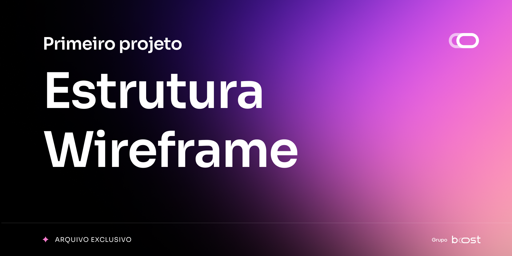
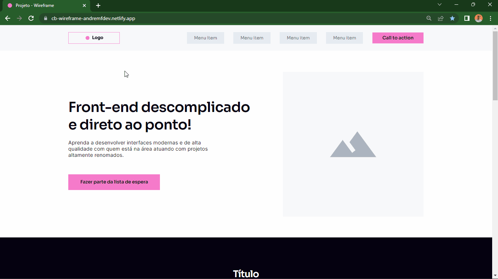
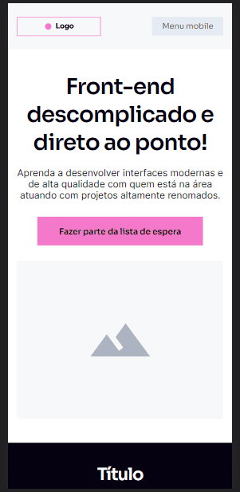
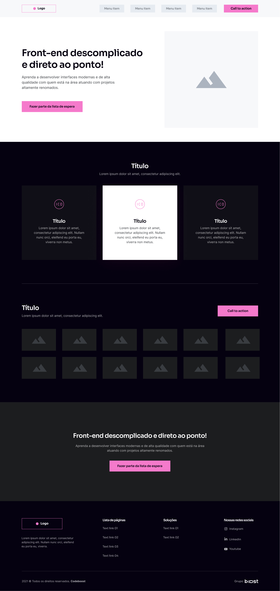
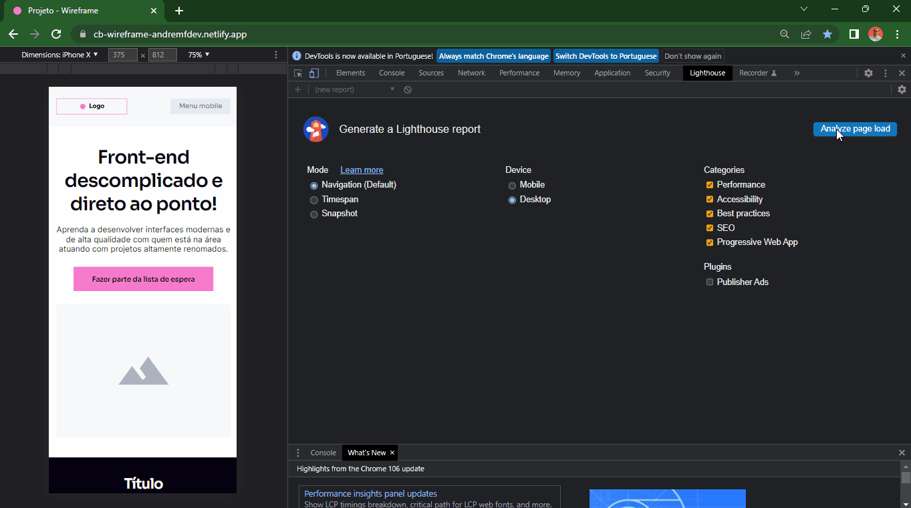

 

<h1 align="center">Projeto Wireframe </h1>

 <a href="#about">About</a> •
 <a href="#layout">Layout</a> •
 <a href="#deploy">Deploy</a> •
 <a href="#audit">Audit Metrics</a> •
 <a href="#challenges">Challenges</a> •
 <a href="#stack">Stack</a> •
 <a href="#autor">Autor</a>

 
 

<h3 id="about"><strong>📝 About</strong></h3>

Primeiro projeto realizado no curso CodeBoost e também meu primeiro contato com desenvovimento em programção, aplicando conhecimentos em HTML5 e CSS3. Neste projeto, pude colocar em prática a importância de ter uma estrutura HTML bem feita para que possamos criar qualquer tipo de layout, seja ele o mais simples ou o mais complexo.

Um dos pontos de importância neste projeto foi a construção da responsividade, deixando assim a página flúida entre os diversos tipos de tela, gerando uma maior acessibilidade.

 

 
<h3 align="center"><strong>Desktop model</strong></h3>

  
  <h3 align="center"><strong>Mobile model</strong></h3>

  

 

<h3 id="layout"><strong>📐 Layout</strong></h3>

Layout disponível no curso CodeBoost do Mentor Will Moreira (Insany Design). Por razões de lei, não posso conceder acesso ao projeto original. Segue em PNG a base do design.
 
 
 

<h3 align="center"><strong>Desktop model</strong></h3>
 

  

 
<h3 id="deploy"><strong>🌐 Deploy</strong></h3>

Segue o resultado do projeto desenvolvido • [Wireframe-andremfdev ](https://cb-wireframe-andremfdev.netlify.app/)

 

<h3 id="audit"><strong>🔍 Audit metrics - Lighthouse</strong></h3>

O Lighthouse é uma ferramenta automatizada de código aberto que melhora a qualidade dos aplicativos da web. Ele pode ser executado como uma extensão do Chrome ou a partir da linha de comando. Informe ao Lighthouse um URL que você deseja auditar. Ele executará uma série de testes na página e relatará o desempenho da página. Neste relatório, você pode usar os testes que falharam como indicadores do que pode ser feito para melhorar o aplicativo.

Observação: no momento, o Lighthouse se concentra principalmente nos recursos do Progressive Web Apps, como Adicionar à tela inicial e suporte ao modo offline. No entanto, o objetivo geral do projeto é fornecer uma auditoria abrangente de todos os aspectos da qualidade de um aplicativo da web.

Aplicando os conhecimentos, e buscando aperfeiçoar cada vez mais pude obter um excelente resultado para a construção desse pequeno projeto (Wireframe). Como podem ver o resultado bateu uma performance de 100 

 

  

 

<h3 id="challenges"><strong>🎯 Challenges</strong></h3>

- [x] Desktop version
- [x] Mobile version
- [x] Flexbox
- [x] Responsive
- [x] Transition
- [x] Transform

 

<h3 id="stack"><strong>⚙️ Stack</strong></h3>

As tecnologias utilizadas para este projeto foram:

- [HTML](https://developer.mozilla.org/en-US/docs/Web/HTML)
- [CSS](https://developer.mozilla.org/en-US/docs/Web/CSS)

 

<h3 id="autor"><strong>👨‍💻 Autor</strong></h3>

Made by andremfdev 👋

